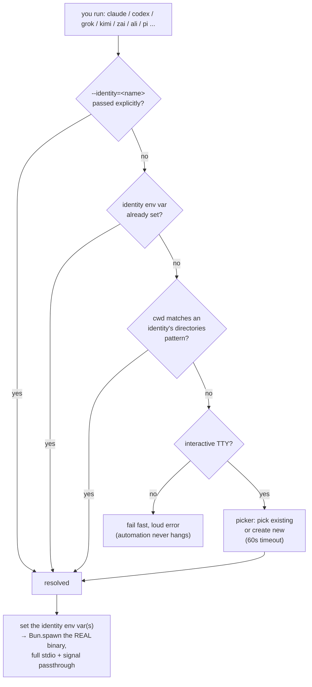

# AiProfileSwitcher

Switch between multiple `claude` / `codex` / `grok` / `kimi` / `zai` / `ali` / `pi`
identities — each with its own isolated config, auth, history, and plugins —
without ever exporting an env var by hand. `zai` and `ali` are a bit
different from the other five: neither is a real CLI; both are fake proxy
names this project invents for the REAL `crush` binary (a multi-provider
terminal coding agent by Charm), `zai` pointed at the ZAI/Z.ai provider so it
runs real GLM models (see "ZAI" below), `ali` pointed at Alibaba Cloud Model
Studio's Token plan (see "ALI" below), each kept in its own separate
`~/.zai` / `~/.ali` set of profiles.

## Why

If you use Claude Code, Codex, Grok, Kimi Code, Pi, or Crush pointed at Z.ai's
GLM models across multiple accounts — personal, a client, an employer — the
native tools have exactly one logged-in identity at a time. Switching means
logging out/in or juggling `CLAUDE_CONFIG_DIR`/`CODEX_HOME`/`GROK_HOME`/
`KIMI_CODE_HOME` by hand, every time, in every shell. This project
installs a thin wrapper in front of each real CLI that picks the right
identity automatically, mostly based on which directory you're standing in.

## How it works

Seven compiled executables, `claude`, `codex`, `grok`, `kimi`, `zai`, `ali`,
and `pi`, install to `~/.local/bin` (ahead of the real Homebrew/`nvm` binaries
on `PATH`; see the grok/kimi PATH caveat below, those tools' own installers
can end up ahead of `~/.local/bin` instead; `zai`/`ali` have no such risk,
since there's no real `zai`/`ali` binary on `PATH` to lose a race against;
their real binary is `crush`, resolved the same way every other wrapper
resolves its own real binary). Each invocation resolves an identity through
the same four-step chain, hands off to the real binary, then starts any
configured SSH exchange in a detached background worker with everything else
forwarded untouched:



1. **`--identity=<name>`** — explicit, always wins.
2. **Env var already set** — `CLAUDE_CONFIG_DIR` / `CODEX_HOME` / `GROK_HOME`
   / `KIMI_CODE_HOME` / `CRUSH_GLOBAL_CONFIG` / `PI_CODING_AGENT_DIR` inherited from a parent process
   (e.g. a nested subagent session honoring its parent's identity).
3. **Directory match** — the cwd matches a pattern in an identity's
   `directories` list in `identities.json`. Resolved silently, no prompt.
4. **Interactive picker** — `@clack/prompts` picker over existing identities
   plus "create new," bounded by a 60-second timeout. Skipped entirely in a
   non-interactive context (piped input, `claude -p`, `codex exec`,
   `grok -p`/`grok agent`, `kimi -p`/`kimi acp`, `zai run`, `pi -p`, no TTY) —
   automation gets a fast, loud error instead of a hang.

`zai`'s real binary is `crush` (github.com/charmbracelet/crush) — a real,
actively-maintained multi-provider terminal coding agent, configured with a
`crush.json` pointing its `"zai"` provider entry at Z.ai's API instead of
some other backend (see "ZAI" below). Unlike an earlier design that
piggybacked on the real `claude` binary, crush is a genuinely GLM-aware
client: it shows the actual model name (e.g. `zai/glm-4.6`), not a
translated Claude alias — the whole reason this project doesn't just point
Claude Code at Z.ai's Anthropic-compatible endpoint instead (that endpoint
transparently remaps whatever model alias Claude Code sends, with no way for
Claude Code's own UI to reflect what actually answered).

No `execve`-style replacement — Bun has no stable primitive for that — so the
wrapper uses `Bun.spawn` with full fd inheritance and explicit signal relay
(`SIGINT`/`SIGTERM`/`SIGHUP`/`SIGQUIT`/`SIGTSTP`), mirroring the child's exit
code. This is the same model `nvm`/`asdf`/`direnv` shims use.

Codex state-DB backfills also self-heal before launch. Codex can leave
`backfill_state.status='running'` behind after its worker exits, then reject
every replacement process for the remainder of its 15-minute lease. The
wrapper checks `state_5.sqlite` and its SQLite sidecars for a real open owner;
when none exists, it expires only that orphaned lease and preserves the last
watermark so Codex resumes immediately. A live worker is never disturbed, and
an ownership check that cannot be completed leaves the database unchanged.

## Directory layout on disk

Each identity's entire config directory is self-contained and swapped in as
`CLAUDE_CONFIG_DIR` / `CODEX_HOME` / `GROK_HOME` / `KIMI_CODE_HOME` /
`CRUSH_GLOBAL_CONFIG` (see "How it works" above):

```
~/.claude/                          ← container, not itself an identity
├── identities.json                 ← registry: name, label, directories, configDir
└── identities/
    └── <name>/                     ← one fully isolated config per identity
        ├── settings.json
        ├── auth …
        └── projects, history, plugins, …

~/.codex/                           ← same pattern for Codex
├── identities.json
└── identities/<name>/…

~/.grok/                            ← same pattern for Grok
├── identities.json
└── identities/<name>/…

~/.kimi-code/                       ← same pattern for Kimi Code
├── identities.json
└── identities/<name>/…

~/.zai/                              ← this wrapper's OWN container, separate
│                                       from ~/.claude's registry on purpose
└── identities/<name>/…                 ← each dir IS a Crush config dir
                                          (crush.json, session state, …), with
                                          crush.json's "zai" provider entry
                                          holding that identity's Z.ai API key

~/.ali/                              ← the SECOND crush-backed proxy's OWN
│                                       container, same shape as ~/.zai's,
│                                       kept separate from it too
└── identities/<name>/…                 ← crush.json's "alibaba" provider
                                          entry, holding the identity's
                                          Alibaba Model Studio API key
```

```text
// identities.json entry
{
  "name": "<name>",
  "label": "<label>",
  "description": "optional",
  "configDir": "~/.claude/identities/<name>",
  "directories": ["<absolute-directory>/*"]
}
```

`directories` pattern grammar is intentionally stricter than a glob dialect:
a plain path matches only that exact directory; a path ending in `/*` matches
it and everything nested beneath it, recursively. Nothing else is supported.
When two identities' patterns both match, the longest (most specific) pattern
wins, and an exact match always outranks a recursive one anchored at the same
directory — a genuine tie falls through to the interactive prompt.

## Module map

```
src/
├── identities/          the account-resolution engine — no process/OS concerns
│   ├── types.ts           Identity / IdentitiesFile / ToolConfig / ResolveOptions
│   ├── store.ts           load/validate/atomic-persist identities.json
│   ├── match.ts           directory-pattern grammar + specificity-scored matching
│   ├── chrome-profile.ts  resolveChromeMcpTarget(): override > active identity
│   ├── chrome-mcp.ts      machine-local per-identity Chrome config + self-heal + CDP tab-open
│   ├── resolve.ts         resolveIdentity(): flag > env > dir-match > prompt/error
│   ├── prompt.ts          @clack/prompts picker + create-new-identity flow
│   ├── zai-auth.ts        writeZaiAuthFile(): non-interactive Z.ai auth for zai identities
│   └── errors.ts          typed IdentityResolutionError subclasses
├── shared/               process/OS mechanics — no identity-resolution logic
│   ├── resolve-binary.ts   find the REAL claude/codex/grok/kimi/crush/open binary,
│   │                      recursion guard — takes a realBinaryName, not a toolName
│   │                      (zai's realBinaryName is "crush", not "zai")
│   ├── exec.ts             Bun.spawn passthrough, signal relay, exit-code parity
│   ├── cli-args.ts         strip --identity=/--desktop, detect non-interactive intent
│   ├── codex-backfill.ts   recover orphaned Codex state-DB backfill leases
│   ├── launch-desktop.ts   best-effort --desktop launch
│   └── run-wrapper.ts      wires the above together; shared by all five entrypoints;
│                          also mirrors ToolConfig.extraEnvVarNames (zai's own
│                          CRUSH_GLOBAL_DATA, alongside its CRUSH_GLOBAL_CONFIG envVarName)
├── sync/                 SSH/rsync profile sync: config validation, portable
│                          registries, newest-file exchange, lock + watcher
├── cli/                  the `ais` management CLI — depends on identities/*, never the reverse
│   ├── dispatch.ts         subcommand routing + error->exit-code handling
│   ├── args.ts             minimal argv parser
│   ├── version.ts help.ts update.ts
│   ├── sync/               `ais sync list|add|remove|now|dedupe`
│   ├── identities/         actions.ts (pure mutations) + resolve-tool.ts (--tool resolution)
│   │                      + dispatch/list/show/create/chrome-overrides.ts (CLI wrappers)
│   ├── limits/             `ais limits`: live/cached provider quota per identity per tool —
│   │                        per-tool fetchers (claude/codex/grok/kimi — kimi's is a live
│   │                        api.kimi.com usages fetch + OAuth token refresh; zai's is a live
│   │                        api.z.ai quota fetch using the key from that identity's own
│   │                        crush.json) + report/watch
│   ├── resume/             `ais resume`: per-cwd resumable-session listing + relaunch —
│   │                        per-tool readers (kimi's reads session_index.jsonl + per-session
│   │                        state.json; zai's reads Crush's own project-local `.crush/crush.db`
│   │                        SQLite file — found via that identity's own projects.json, unlike
│   │                        the other four which store sessions under the identity's own
│   │                        configDir) + picker + launch
│   ├── zai-usage.ts        real local token/message/cost totals for zai, summed straight out
│                          of Crush's own project-local crush.db (bun:sqlite) — Z.ai's API has
│                          no such data, but Crush tracks it locally like every other tool
│   └── usage/              `ais usage`: per-identity/provider token usage & cost via tokscale
│                          tokscale.ts (env-var mapping + --json types) + run.ts (collect
│                          targets, spawn tokscale) + report.ts (table rendering) — zai uses
│                          zai-usage.ts instead of tokscale entirely — see "Usage reporting" below
├── claude.ts             entrypoint: ToolConfig for claude
├── codex.ts              entrypoint: ToolConfig for codex
├── grok.ts               entrypoint: ToolConfig for grok
├── kimi.ts               entrypoint: ToolConfig for kimi
├── zai.ts                entrypoint: ToolConfig for zai — execs the real `crush` binary,
│                        pointed at Z.ai via that identity's own crush.json
├── open.ts               entrypoint: shadows `open`, routes links into the active identity's Chrome (Claude MCP)
└── ais.ts                entrypoint: the `ais` management CLI

scripts/
├── backup.ts    mirrors every real config dir into a persistent git repo at
│               ~/.ais/backups and commits whatever changed
├── migrate.ts   one-time, interactive, moves existing dirs into identities/<name>/
├── build.ts     bun build --compile for all seven entrypoints
└── install.ts   backup + copy compiled binaries to ~/.local/bin
```

This project's own data (backups, SSH sync's local cache/staging, the
`ais upgrade`-managed npm prefix, sync config) all lives under one
consolidated `~/.ais` root — see "SSH profile and usage sync" and "Commands"
below. `~/.local/bin` (the shim binaries themselves, including `ais`) is the
one deliberate exception: those need to be on `PATH` with zero shell-rc
edits, so they stay outside `~/.ais`.

`identities/*` and `shared/*` never import from each other in the wrong
direction — `shared/run-wrapper.ts` depends on `identities/*`, never the
reverse — so the resolution engine stays pure and unit-testable without any
process/TTY/filesystem mocking. `cli/*` follows the same rule: it depends on
`identities/*`, never the reverse, and adds no identity-resolution logic of
its own.

## Setup

```bash
bun install
bun test              # sanity check before touching anything real
bun run migrate        # ONE-TIME, destructive — see warning below
bun run build
bun run install:shims
# open a new terminal (or `hash -r`)
```

> **`bun run migrate` restructures your live `~/.claude` and `~/.codex`
> directories** into the `identities/<name>/` layout above. It takes a full
> backup first (a git commit in the persistent repo at `~/.ais/backups`) and
> refuses to
> run if a `claude`/`codex` process is currently active — close every running
> session first, and run it from a plain terminal, not from inside an active
> Claude Code/Codex session (its own config dir would be one of the
> directories being moved). It does **not** cover `~/.grok`, `~/.kimi-code`,
> or `~/.zai` — that was a one-time migration for pre-existing `~/.claude`/
> `~/.codex` content only. `~/.grok/identities.json`,
> `~/.kimi-code/identities.json`, and `~/.zai/identities.json` all just start
> empty; create your first grok/kimi/zai identity via
> `ais identities create --tool=grok` / `--tool=kimi` / `--tool=zai` or the
> interactive picker. For `zai` specifically, pass `--api-key=<your Z.ai
> key>` (or answer the prompt for it) at creation time — see "ZAI" below.

## Usage

```text
claude --identity=<name>             # explicit
claude                               # auto-detect from cwd, or prompt
codex --identity=<name> app .        # launch the Codex desktop app
claude --identity=<name> --desktop   # best-effort: launch Claude.app directly
grok --identity=<name> "fix the bug"
kimi --identity=<name> -p "fix the bug"
zai --identity=<name> run "fix the bug"
pi --identity=<name> -p "fix the bug"
```

> **grok's and kimi's own installers can put their real binary ahead of this
> wrapper on `PATH`.** Unlike Homebrew's `claude` or `nvm`'s `codex`, the
> official Grok CLI installer appends `export PATH="$HOME/.grok/bin:$PATH"`
> to your shell rc, and Kimi Code's installer does the same with
> `export PATH="$HOME/.kimi-code/bin:$PATH"` (confirmed at `~/.zshrc`:166-167
> on this machine) — either line can end up **ahead** of your `~/.local/bin`
> export, depending on where it lands relative to it. Check with
> `which grok` / `which kimi` after `bun run install:shims`: if either
> doesn't print `~/.local/bin/<tool>`, move that tool's PATH line in your
> shell rc (e.g. `~/.zshrc`) to *before* the line exporting `~/.local/bin`,
> then open a new terminal. See `AGENTS.md` for the full caveat. `zai` has no
> equivalent risk — there's no real `zai` binary anywhere to lose a PATH race
> against; the real binary it execs is `crush`, resolved the same way every
> other wrapper resolves its own real binary.

## ZAI

`zai` doesn't proxy a CLI called "zai" — there isn't one, and (despite an
earlier assumption in this project's own history) neither is Z.ai's own
"ZCode" product a CLI: it's a desktop-only Electron app with no terminal
interface at all. This project tried two other designs before landing on the
current one — see `AGENTS.md`'s "zai case study" (now on take 3) for the
full history — but the short version:

Z.ai's GLM Coding Plan ships an **Anthropic-compatible API endpoint**, which
means the real Claude Code CLI *can* work as a drop-in client with zero code
changes. It's also the wrong choice: that endpoint transparently remaps
whatever model alias Claude Code sends (e.g. "opus") to a GLM model
server-side, but Claude Code's own UI has no visibility into that remap —
it keeps showing its own Anthropic alias regardless of what actually
answered. `zai` instead proxies **[Crush](https://github.com/charmbracelet/crush)**,
a real, actively-maintained multi-provider terminal coding agent by Charm
(also [officially documented by Z.ai](https://docs.z.ai/devpack/tool/crush)
as a supported integration) — it's genuinely aware it's talking to Z.ai, so
it shows the real model name (`zai/glm-4.6`, not a translated alias).

`zai --identity=<name> ...` resolves an identity exactly like the other four
wrappers, then execs the real `crush` binary with `CRUSH_GLOBAL_CONFIG`
pointed at that zai identity's own directory (holding `crush.json`) and
`CRUSH_GLOBAL_DATA` pointed at a `data/` subdirectory beneath it (Crush's own
session/model-cache state) — the two must resolve to different directories,
not the same one: pointing both at the literal same path was tried first and
confirmed to make Crush double-register every provider/model.

Getting the key into place is a solved, non-interactive one-time step —
`ais identities create --tool=zai --api-key=<your Z.ai key>` (or answer the
prompt for it if you omit the flag; leave it blank to configure Crush
manually later instead) writes it directly, along with everything needed to
restrict Crush to **just** GLM (no Gemini/Grok/OpenAI/etc. cluttering the
model picker, which Crush otherwise shows by default for every provider it
knows about):

```json
// ~/.zai/identities/<name>/crush.json
{
  "providers": {
    "zai": {
      "type": "openai-compat",
      "name": "ZAI Provider",
      "base_url": "https://api.z.ai/api/coding/paas/v4",
      "api_key": "<your Z.ai API key>",
      "discover_models": true,
      "models": [
        { "id": "glm-4.6", "name": "GLM-4.6", "...": "... (11 GLM models total)" }
      ]
    }
  },
  "options": {
    "disable_default_providers": true
  }
}
```

`disable_default_providers` is what actually restricts the model list — it
skips Crush's entire built-in provider catalog, but then requires the "zai"
entry to be fully self-contained (`type` + a real `models` list) to still
count as configured, which is why both are written even though Crush already
knows about Z.ai natively. `discover_models: true` lets a working key
overlay a live-fetched model list from Z.ai's own API on top of the static
one shown above, so it stays accurate even if Z.ai adds models later; the
static list is what keeps an identity created with a blank key (see above)
still able to start Crush and browse models before a real key is added.

Rotate the key later without recreating the identity:
`ais identities update <name> --tool=zai --api-key=<new key>`.

`~/.zai` is kept as its OWN registry, separate from `~/.claude`'s, on
purpose: the same identity name can exist in both registries while referring
to genuinely different provider accounts.

`ais limits --tool=zai` works, live, today, using that identity's own Z.ai
API key (the same one `crush.json` holds) — no extra setup needed beyond
having created the identity with a real key. `ais usage --tool=zai` works
too, with real MESSAGES/INPUT/OUTPUT and an estimated public-price COST just like every other
tool — Z.ai's own API has no endpoint that exposes that, but Crush tracks it
locally in the same project-local `.crush/crush.db` SQLite file `ais resume`
already reads, and this project sums it directly. Live quota percentages
are a separate concern, fully covered by `ais limits` above — `ais usage`
doesn't duplicate them.
`ais resume --tool=zai` also works
today: unlike the other four tools, Crush stores its actual session data in
a project-local `.crush/crush.db` (a real SQLite file, the same
"one dotdir per project" model `.git` uses) rather than under the
identity's own configDir — this project reads that identity's own
`projects.json` to find which project directories it's been used in, then
queries the matching one's `crush.db` directly.
`ais identities` (list/show/create/...) works for zai exactly like every
other tool.

## ALI

`ali` is the second fake proxy identity this project invents for the real
`crush` binary, this time pointed at **Alibaba Cloud Model Studio's Token
plan**: an Anthropic-compatible endpoint at
`https://token-plan.ap-southeast-1.maas.aliyuncs.com/apps/anthropic`. It
follows the exact same non-interactive-auth recipe as `zai` (see "ZAI"
above and `AGENTS.md`'s "ali case study" for the full history), with two
notable differences:

- **No `discover_models`.** Alibaba's Token plan endpoint has no model-list
  endpoint at all (only `/v1/messages`), so there's nothing for Crush to
  live-fetch; the static model list in `crush.json` is the only source of
  truth, not a fallback.
- **A bespoke `ALI_CONFIG_DIR` env var**, not `CRUSH_GLOBAL_CONFIG` (zai's
  own). Since both `zai` and `ali` proxy the same `crush` binary, this
  project needs a way to tell an active `ali` session apart from an active
  `zai` session. `ALI_CONFIG_DIR` is that marker; the real
  `CRUSH_GLOBAL_CONFIG`/`CRUSH_GLOBAL_DATA` vars `crush` itself reads are
  still set underneath it.

`ais identities create --tool=ali --api-key=<your Alibaba Model Studio API
key>` writes it directly into `~/.ali/identities/<name>/crush.json`, same
shape as `zai`'s. `ais identities update <name> --tool=ali --api-key=<new
key>` rotates it later. `~/.ali` is its own registry, separate from
`~/.zai`'s and every other tool's, for the same reason: the same identity name
can exist in several tool registries while referring to genuinely different
accounts.

Alibaba's Token plan has no API-key quota endpoint, but `ais limits
--tool=ali` reads its live 5-hour/weekly windows through Alibaba's OneConsole
gateway using a valid console Cookie header in the identity's own
`console-cookie.txt`.
`ais usage --tool=ali` and `ais resume --tool=ali` both work exactly like
`zai`'s, reusing the identical local `.crush/crush.db` reading logic (the
underlying code is now shared between the two tools, not duplicated).

## Pi

`pi` proxies the real multi-provider Pi coding-agent CLI. Each Pi identity is
isolated with Pi's documented `PI_CODING_AGENT_DIR`, which contains its
`auth.json`, `models.json`, settings, extensions and sessions.

One Pi identity can import credentials from all six provider-specific AIS
registries plus OpenCode Go without printing their values. The command shape
uses placeholders rather than embedding example identity names:

```text
ais auth import <pi-id> --tool=pi \
  --claude=<claude-id> --codex=<codex-id> --grok=<grok-id> \
  --kimi=<kimi-id> --zai=<zai-id> --ali=<ali-id> --opencode-go
```

The importer merges `anthropic`, `openai-codex`, `xai`, `kimi-coding`, `zai`
and `alibaba-plan` credentials, plus the native `opencode-go` provider, into
Pi's `auth.json` with mode `0600`. `--opencode-go` reads `OPENCODE_API_KEY` or
opens a masked prompt, so the key never needs to appear in argv or shell
history. Pi supplies OpenCode Go's provider-owned model catalogue; use Ctrl+P
in Pi or `pi --identity=<pi-id> --list-models opencode-go` to see it, and use
`--model=<provider>/<model>` to launch a model directly.
Alibaba's existing Crush model list is translated into a native Pi custom
provider in `models.json`; no executable third-party Pi extension is needed.
OAuth tokens then refresh independently inside Pi, so subsequent refreshes do
not get copied back into the original provider CLI profile.

## CLI (`ais`)

An eighth binary, `ais`, manages `identities.json` so you never have to
hand-edit it:

```bash
ais version                                              # print the installed version
ais update                                                # re-download the latest claude/codex/grok/kimi/zai/ali/pi/open/ais
ais upgrade                                               # install/upgrade every real CLI required by the installed AIS shims

ais sync list                                             # configured SSH aliases
ais sync add myhost                                          # add a host from ~/.ssh/config
ais sync remove myhost
ais sync now [--pull-only|--push-only] [--tool=<t> --identity=<id>]
ais sync dedupe [--dry-run] [--json]                     # local stable-session-ID merge
ais sync recover [--dry-run] [--json]                    # restore retained pre-fix recovery archives

ais identities list                                       # all registries; add --tool=claude|codex|grok|kimi|zai|ali|pi to scope
ais identities show <name>
ais identities create --tool=<t> [--name=] [--label=] [--description=] \
                       [--directories=a,b] [--aliases=x,y] [--api-key=]
                                                           # any field omitted prompts interactively
                                                           # (--api-key is zai/ali-only, see "ZAI"/"ALI" above)
ais identities update <name> --tool=<t> [--label=] [--description=] [--configDir=] [--api-key=]
ais identities delete <name> --tool=<t> --yes             # registry only — configDir is left on disk
ais identities add-directory <name> <pattern> --tool=<t>
ais identities remove-directory <name> <pattern> --tool=<t>
ais identities add-alias <name> <alias> --tool=<t>
ais identities remove-alias <name> <alias> --tool=<t>
ais identities chrome-overrides list [--tool=]
ais identities chrome-overrides add --tool=<t> --directories=a,b --target-identity=<name> [--label=]
ais identities chrome-overrides remove --tool=<t> <index>

ais auth import <pi-id> --tool=pi --claude=<id> --codex=<id> --grok=<id> --kimi=<id> --zai=<id> --ali=<id> [--opencode-go]

ais usage                                                 # token usage & cost, every identity/provider
ais usage --identity=<name>                               # scope to one identity (all tools it's configured for)
ais usage --tool=claude|codex|grok|kimi|zai|ali|pi        # scope collection to one client registry; rows still name providers
ais usage --json                                          # provider-first structured output, with client names removed

ais usage tui                                             # full tokscale TUI, every identity/provider merged
ais usage --identity=<name> [--tool=] <tokscale args>     # full tokscale, scoped to just that one identity
ais usage <tokscale args>                                 # full tokscale, every identity/provider merged
ais usage --identity=<name> tui                           # interactive TUI for one identity
ais usage --identity=<name> --tool=codex monthly          # monthly Codex breakdown for one identity
ais usage pricing "claude-sonnet-5"                       # e.g. identity-agnostic commands need no --identity
# "--" before the tokscale args is optional (ais usage -- tui works too) —
# only needed if the very first tokscale token would otherwise look like
# one of ais's own --identity=/--tool=/--json flags.

ais resume                                                # list resumable sessions; Pi currently reports resume as unavailable
ais resume --identity=<name>                              # scope to one identity
ais resume --json                                         # machine-readable list instead of a table
ais resume 2                                              # relaunch the #2 listed session
ais resume <session-id>                                   # relaunch by exact session id (stable across runs)
```

## SSH profile and usage sync

`ais sync` keeps every registered identity's durable profile state — auth,
settings, plugin declarations, skills, memories, histories, and session/usage
data — in sync across one or more hosts reached through normal SSH config. The remote
uses the same relative layout below its own home, so macOS
`/Users/<name>/...` and Linux `/home/<name>/...` work together. Standard
registry and project paths are persisted as portable `~/...` paths.

```json
// ~/.ais/config/sync-v2.json (machine-local; not itself synchronised)
{
  "version": 2,
  "remotes": ["myhost", "backup-host"]
}
```

Each top-level `claude`/`codex`/`grok`/`kimi`/`zai`/`ali` launch spawns the real agent
first, then starts a detached worker that pulls from every remote, merges the
result, and pushes the converged state back. SSH, rsync, deduplication, and
lock waits therefore never delay agent startup. Ordinary profile/session
mutations trigger a three-second debounced detached pull/merge/push; SQLite
data waits for a detached final reconciliation after the child exits. Nested
agents still participate in the final reconciliation without starting another
full exchange.
The sync-aware `ais identities`, `ais usage`, `ais limits`, and `ais doctor`
commands exchange before reading and push again afterwards. `ais resume`
uses the same spawn-first background behaviour as the direct wrappers.

Every exchange deduplicates usage/session data by each native tool's stable
session ID *within the same identity*. A matching ID in two identities is not
permission to move either identity's copy. Legacy top-level stores are assigned
only when the recorded cwd or a sole matching identity makes that safe. Copied
JSONL histories count once; genuinely divergent events are append-unioned.
Automatic reconciliation never prunes a live path. An explicit
`ais sync dedupe` may move redundant same-identity paths to the recoverable
`~/.ais/remote-cache/dedupe-backups/` archive. Registry conflicts are merged
semantically (identities, aliases, directory rules, and Chrome overrides are
unioned) rather than selecting one whole file. Use `ais sync dedupe --dry-run`
to inspect a machine or `ais sync dedupe` to apply the invariant without
contacting a remote. `ais sync recover` additively restores JSONL histories and
missing sidecars from retained pre-fix conflict/dedupe archives; it never
deletes those recovery copies.

Zai/Crush is covered despite its unusual storage model: the identity profile
lives under `~/.zai`, while each registered project's actual `crush.db` lives
in that project's `.crush` directory. Home-relative registered project data
is included alongside the profile. Crush's machine-local absolute-path
`projects.json` index is intentionally not copied between operating systems.

Generic files use compressed rsync and deletes are never propagated. Pulls
land in an isolated incoming tree before any live path changes. JSONL histories
are merged append-only into live files; pushes likewise land in a remote
incoming tree and remote AIS performs the merge. Neither transport direction
rsyncs over a live history. Incoming trees use a checksummed receiver-side
comparison, so byte-identical live files are omitted from staging. Ordinary non-session files resolve by newest
modification time, with the losing bytes retained in a conflict tree. Sender
UID, GID, and directory permissions are never
applied to the receiving home; this is essential when synchronising a macOS
user into Linux's `/root`.

Lock/socket/PID files and every live SQLite database (including WAL/SHM/
journal sidecars) are excluded from generic rsync. Zai/Crush databases move
through SQLite-created `VACUUM INTO` snapshots and merge by stable row IDs;
duplicate session totals use the maximum recorded counters rather than being
summed. A live database file is never copied directly. Reproducible or
machine-specific browser
profiles, plugin/marketplace caches and clones, dependency trees, logs/debug
output, worktrees, generated media, shell snapshots, and rebuildable Codex
index/log databases are also excluded; their small durable declarations stay
in sync and each native tool recreates the local payload. Profile directories
outside the user's home are rejected rather than silently omitted.

Both machines need rsync 3.2.3 or newer (`--mkpath`) and the SSH host key must
already be trusted. SSH runs with `BatchMode=yes` and
`StrictHostKeyChecking=yes`; it never asks for a password, key passphrase, or
host-key confirmation. A short-lived multiplexed SSH connection and keepalive
cover the pull/push pair plus debounced updates without repeated logins.
Automatic sync workers are detached with their output discarded, so failures
cannot delay or interrupt the AI CLI; `ais sync now` instead waits and returns
an error. Set
`AIS_SYNC_CONFIG=/path/to/sync.json` to use a non-default config in automation.

Protocol v2 deliberately uses `sync-v2.json`. An already-running pre-v2
wrapper continues to read the separate legacy `sync.json`, which can remain a
valid empty v1 file; this prevents stale in-memory watchers from both emitting
version errors and reviving the old transport after an upgrade.

Each alias is a direct outbound target from that machine. AIS does not copy
SSH keys or create a relay: if a host must initiate its own pushes, its SSH
config and keys must already let it reach at least one configured target. A
hub can list several downstream hosts to distribute the merged state.

Profile sync includes provider credentials by design. Only configure hosts
you trust to hold those credentials.

`ais upgrade` treats an installed AIS shim as the declaration that its real
CLI should exist. It installs/upgrades Claude Code, Codex, Kimi Code, and
Crush (the real CLI behind `zai`) in AIS's user-owned npm prefix at
`~/.ais/npm`, and installs Grok with xAI's official release
installer. The wrappers prefer those managed
binaries immediately, even in an already-open shell. Native self-updaters are
only a fallback and are invoked only when the installed CLI explicitly lists
the subcommand in `--help`; this prevents old Codex versions from interpreting
the word `update` as a chat prompt. npm install scripts are enabled only for
the known packages that require them, rather than through npm's broad
allow-all switch. `ais update` remains separate: it updates the AIS wrapper
binaries themselves.

`claude`'s, `codex`'s, `grok`'s, `kimi`'s, `zai`'s, and `ali`'s `identities.json`
are independent registries, so `--tool=claude|codex|grok|kimi|zai|ali|pi` is always
required for `create` (the name doesn't exist yet in any of them) — but every
other name-targeted mutation auto-resolves `--tool` when the name exists in
only one registry, and only demands the flag when it exists in more than one
(or none).
`list`/`show`/`chrome-overrides list` default to showing all registries when
`--tool` is omitted.

## Usage reporting (`ais usage`)

`ais usage` shows token usage and cost broken down by identity and actual
upstream provider — **Anthropic/OpenAI/xAI/Kimi/Z.ai/Alibaba**, never the
wrapper tool that happened to send the request. Native-client history and
Pi history for the same `(provider, identity)` are merged into one row.
[tokscale](https://github.com/junhoyeo/tokscale) reads the native Claude,
Codex, Grok, and Kimi stores; AIS reads Crush and Pi's own local records
directly. tokscale itself isn't a dependency of this project (it ships heavy
platform-specific native binaries); it's resolved from `PATH` if already
installed, otherwise fetched on demand via `bunx tokscale@latest`.

Each provider needs a different trick to scope tokscale to one identity —
confirmed empirically against real identity data, not assumed from tokscale's
docs:

- **codex / grok / kimi**: tokscale itself reads `CODEX_HOME`/`GROK_HOME`/
  `KIMI_CODE_HOME` to locate session data — the same env vars this project
  already redirects per identity, so no extra step is needed.
- **claude**: tokscale hardcodes `~/.claude/projects` and has no
  `CLAUDE_CONFIG_DIR`-equivalent override, so `ais usage` instead sets
  `TOKSCALE_EXTRA_DIRS=claude:<identity's configDir>/projects` — an additive
  extra scan root tokscale does support. No symlinks needed; the top-level
  `~/.claude` container this project uses has no `projects/` of its own, so
  tokscale's normal default scan root contributes nothing to double-count.
- **pi**: AIS recursively reads `<PI_CODING_AGENT_DIR>/sessions/**/*.jsonl`.
  Every Pi assistant message records its provider, model, input/output,
  cache read/write, cost, and timestamp, so traffic is attributed to its
  real provider and contributes to the model totals, date range, and daily
  graph. Stable message metadata is deduplicated across copied/forked
  histories. Pi's `openai-codex`/`claude-cli`/`kimi-coding` aliases are
  normalised to OpenAI/Anthropic/Kimi rather than shown as extra tools. Pi's
  `party-cli` aggregate is split across its named upstream members, so Party
  is never presented as a provider. When Pi's `claude-cli`/`codex-cli`/party
  adapters spawn the native AIS-wrapped clients, the combined report prefers
  those native counters instead of counting the same calls twice; a
  Pi-scoped report still shows their provider-attributed Pi records.
- **zai**: works like every other tool — real MESSAGES/INPUT/OUTPUT plus an estimated public-price COST
  numbers, summed into the TOTAL row, no separate section or asterisk. The
  source is different, though: Z.ai's own API has no endpoint anywhere that
  exposes historical token counts or costs, but Crush tracks that data
  locally, in the exact same project-local `.crush/crush.db` SQLite file
  `ais resume` reads (see above) — this project sums `message_count`/
  `prompt_tokens`/`completion_tokens`/`cost` directly out of it across every
  project directory that identity has ever used Crush in. `CACHE READ`/
  `CACHE WRITE` are genuinely `0` for zai — Crush's local storage has no such
  breakdown at all, not a gap in this reader. A brand-new identity with no
  Crush sessions yet reports "no local Crush session data yet for this
  identity" rather than a fabricated number. Live quota percentages (session/
  weekly/web-tools used right now) are a completely separate concern,
  already fully covered by `ais limits --tool=zai` — `ais usage` doesn't
  fetch or display them at all, to avoid mixing two different kinds of data
  in one report.

`ais usage <tokscale args>` gives you everything else tokscale can do — the
interactive TUI, `graph`, `monthly`, `hourly`, `pricing`, `report`, `wrapped`,
the social commands — not just the aggregate table. Everything after the
recognized `ais` flags (an explicit `--` is optional, only needed if the
first tokscale token would otherwise look like one of ais's own flags) is
forwarded to the real tokscale process verbatim, with full stdio/TTY
inheritance (so the TUI's raw-mode terminal handling works).

- **`--identity=` given**: scoped to exactly one identity (pass `--tool=` too
  if that name is configured for more than one tool).
- **`--identity=` omitted**: NOT the same as tokscale's own bare defaults,
  which would resolve to this project's top-level `~/.claude`/`~/.codex`/
  `~/.grok`/`~/.kimi-code` containers — deliberately empty of real session
  data (see "Disk layout" above). Instead every configured identity
  (optionally narrowed by `--tool=`) is merged into one `TOKSCALE_EXTRA_DIRS`
  value and queried in a single tokscale process, so `ais usage tui` shows
  everything across every account and provider by default, the way tokscale's
  own TUI is meant to be used. Identity-agnostic commands like `pricing
  "<model>"` work the same way regardless — the merged scan roots are simply
  irrelevant to them.
  One caveat: tokscale itself has no "identity"/"account" concept for claude,
  grok, or kimi (only client/model/workspace/session) — merging several
  identities' data into one process means tokscale sees one undifferentiated
  pool of claude sessions, not four separate accounts. `--group-by workspace,model`
  is the closest tokscale-native approximation of "by account" (each
  identity's projects tend to live under distinct directories), but it's a
  correlation, not a first-class field. codex/cursor have their own
  account-switching features (`tokscale codex accounts`) — unrelated to and
  not integrated with this project's identity model.

One non-obvious detail if you're touching `src/cli/usage/passthrough.ts`:
tokscale's `--client` flag has to come *after* the subcommand you're passing
through (`tokscale models --client claude`), not before (`tokscale --client
claude models` silently ignores the filter and leaks every other client's
data in) — confirmed by direct testing, not documented anywhere in tokscale
itself.

One more thing worth knowing if you're touching `src/cli/usage/`: when
tokscale isn't already on `PATH` and has to run via `bunx`, its own
install/link step is not safe for concurrent invocations — running several
`bunx tokscale@latest` processes at once can fail with `EEXIST` even against
an already-warm package cache. `ais usage`'s aggregate report serializes its
tokscale calls in that case (parallelizing freely once tokscale is actually
on `PATH`, where no such race exists) — this doesn't apply to passthrough
mode, which only ever runs one tokscale process at a time anyway.

## Managing identities

Use `ais identities ...` (above) for anything scriptable, or "Create new
identity" in the interactive picker (triggered by running `claude`/`codex`/
`grok`/`kimi`/`zai`/`ali` with no flag and no directory match) for a guided first
identity. Hand-editing `~/.claude/identities.json` /
`~/.codex/identities.json` / `~/.grok/identities.json` /
`~/.kimi-code/identities.json` / `~/.zai/identities.json` / `~/.ali/identities.json`
still works too.

## Desktop apps

- **Codex**: `codex --identity=<name> app [PATH]` — routed through the codex
  wrapper so `CODEX_HOME` is already correct before the desktop app launches.
- **Claude**: `claude --identity=<name> --desktop` launches `Claude.app`'s
  real binary directly (bypassing `open`, which doesn't forward env vars)
  with `CLAUDE_CONFIG_DIR` set. Best-effort — see `AGENTS.md` for the caveat
  around Claude.app's own OAuth session.
- **Grok**: no native `grok app` subcommand exists, and no `Grok.app` desktop
  bundle was found on the machine this was built on. `grok --identity=<name>
  --desktop` is wired up structurally (same code path as Claude's) for
  consistency, but is unverified and will most likely just fail resolving
  `/Applications/Grok.app` — see `AGENTS.md`.
- **Kimi**: same situation as Grok — no `kimi app` subcommand exists, and no
  `/Applications/Kimi*.app` desktop bundle was found on this machine (checked
  2026-07-17). `kimi --identity=<name> --desktop` is wired up structurally
  (same code path as Claude's) for consistency, but is expected to just fail
  resolving the app bundle — see `AGENTS.md`.
- **zai**: same situation as Grok/Kimi — its real binary, `crush`, is a
  terminal-only CLI with no known desktop app bundle. `zai --identity=<name>
  --desktop` is wired up structurally for consistency, but is expected to
  just fail resolving `/Applications/Crush.app` — see `AGENTS.md`.

## Chrome (Claude MCP) redirect per identity

Links Claude Code/Codex/Grok/Kimi Code (and zai/ali, though neither has OAuth login
flow of its own to trigger this) open automatically (OAuth login, etc.) open
in that identity's own isolated **Chrome (Claude MCP)** browser instance
— the same dedicated, per-identity automation browser the `chrome-devtools` MCP
server uses (see the `chrome-mcp-profile` shared skill) — not your real
daily-driver Chrome. Machine-specific identity names, ports, and Chrome
profile directories live only in `~/.ais/config/chrome-mcp.json` (or the path
set in `AIS_CHROME_MCP_CONFIG`), never in this repository. The version-1 file
contains an `identities` object keyed by identity name; each value contains a
unique integer `port` and a non-empty `profileDir`. A per-directory override
can redirect one project to a different configured identity's browser.

`chromeProfileOverrides` uses the same directory-pattern grammar as
`directories` above and always wins over the naturally active identity when
the cwd matches.

This works by installing a sixth shim, `open`, ahead of `/usr/bin/open` on
`PATH` — built and installed on macOS only (there's no bare `open` command on
Linux to shadow/fall back to). It only ever changes behavior for the single
plain shape `open <url>` invoked from a process descended from a session our
own `claude`/`codex`/`grok`/`kimi`/`zai`/`ali` wrapper actually launched (not just
any process that happens to have `CLAUDE_CONFIG_DIR`/`CODEX_HOME`/
`GROK_HOME`/`KIMI_CODE_HOME`/`CRUSH_GLOBAL_CONFIG` in its environment — a
manually-exported one in your shell rc doesn't count).
It resolves the identity's Chrome (Claude MCP) instance's remote-debugging
port (self-starting it via `devserver` if it's down) and opens the URL as a
new **background** tab over the full CDP WebSocket protocol
(`Target.createTarget` with `background: true, newWindow: false` — not the
simpler HTTP `/json/new` endpoint, which has no way to avoid activating the
new tab and stealing window focus) — it never launches a new Chrome
*process*, since a second `Chrome (Claude MCP).app`
launch pointed at a different `--user-data-dir` while one is already running
silently hands off to whichever instance started first (see the
`chrome-mcp-profile` skill). Every other invocation (opening files, `open -a`,
`open .`, unrelated shells, etc.) passes through completely unchanged, and a
resolution/self-heal failure falls through to unmodified `open` too — loudly,
via a `console.error` diagnostic, never silently.

## Commands

| Command | What it does |
|---|---|
| `bun test` | Run the unit test suite |
| `bun run build` | Compile all proxies and management entrypoints into `dist/` (`claude`, `codex`, `grok`, `kimi`, `zai`, `ali`, `pi`, `open` on darwin, `ais`, `install`) |
| `bun run backup` | mirrors every real config dir into the persistent git repo at `~/.ais/backups` and commits whatever changed |
| `bun run migrate` | One-time, destructive: restructure into `identities/<name>/` (claude/codex only, see above) |
| `bun run install:shims` | Backup, then copy compiled binaries to `~/.local/bin` |

See `AGENTS.md` for full internal design rationale and the key
decisions-not-to-relitigate.
